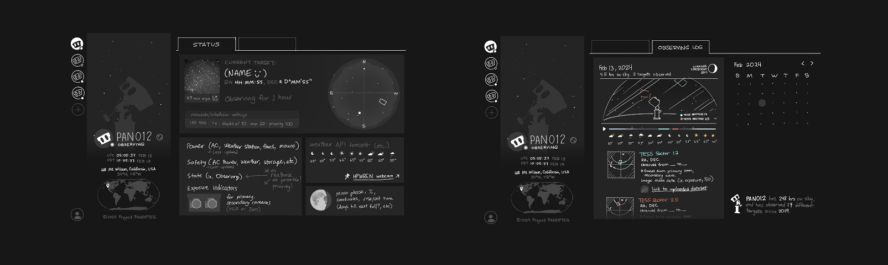
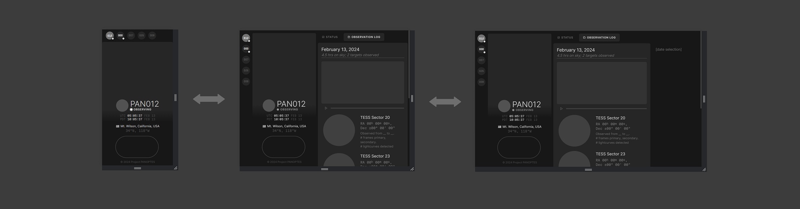
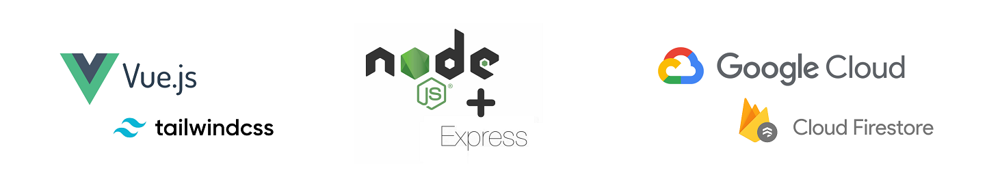

# PANOPTES Dash

This is a web app in early development for the global citizen science program [Project PANOPTES](https://www.projectpanoptes.org/). It will list online PANOPTES robotic telescope units, with an interface for conveniently viewing their individual statuses and observing activity. 🔭🌐💻📱

Below is a brief development roadmap, design/technical information, and setup instructions for local development.

## Development Roadmap

I am working on this over the course of the school year as my ASTRO 199 senior project at UCLA. Here are the things I've done so far, and what I have planned:

### Winter (Jan–Mar 2024)

This quarter was spent doing initial planning and design work for the frontend of the individual unit dashboard page.

- [x] **Itemized all types of data** that would be useful to display on the app (unit telemetry and geographical information, weather conditions, observations) for its target audience of 1) PANOPTES unit builders and 2) members of the general public; **narrowed down app's core features** (namely various info widgets, and auto-generated observing logs.)

- [x] **Decided on a tech stack** based on certain criteria (see [*Web Frameworks*](#Web-Frameworks) below)

- [x] **Designed concepts for the dashboard's responsive layout,** which will consist of *Status* and *Observing Log* panels:

  

- [x] **Created a responsive grid layout** styled in Tailwind CSS with hardcoded, placeholder Vue components:
  

### Spring (Apr–Jun 2024)

I intend to spend this quarter learning both Vue and the Google Cloud Platform more thoroughly, to:

- [ ] **Deploy app to the Google Cloud Platform** for testing
- [ ] **Receive and display telemetry** from the PAN000 test unit
- [ ] **Design and implement dashboard info widgets:** the observing progress, sensor telemetry, weather, and moon widgets on the *Status* panel
- [ ] **Implement the observing log feature** to summarize a unit's observations from any given night; **implement date selectors** (monthly calendar + yearlong length-of-day/night)

### Fall 2024 (Oct–Dec 2024)

To wrap things up, I will be focusing on the exciting data visualization aspects of the app:

- [ ] Making **2D astronomical and geographical data visualizations** (for current and past observations)
- [ ] Connect to (and improve) the existing [**panoptes3d**](https://github.com/sarumanplaysguitar/panoptes3D) tool for **3D unit pointing and sky visualization**
- [ ] Create a landing page with **PANOPTES's global network-wide status and statistics** (if there is time)

## Design and Technical Information

### Design Considerations

**JavaScript and related web technologies** were chosen to create this dashboard, as they are well-suited for the following requirements:

- Continuous, **real-time** (or periodic) unit telemetry updates
- **Responsiveness and compatibility** across different screen sizes and devices (phone, tablets, computer-sized screens)
- Strong **2D/3D data visualization tools,** namely the **[D3](https://d3js.org/)** and **[Three.js](https://threejs.org/)** JavaScript libraries

(Additionally, in the future, a tool like **[Electron.js](https://www.electronjs.org/)** can be used to modify this web app to run locally as a **standalone computer program,** perhaps bundled with control software to support offline units or those with bandwidth restrictions.)

### Web Frameworks



- **Frontend:** The **[Vue.js](https://vuejs.org/)** framework (Composition API) will be used to create the dashboard UI, binding HTML to JavaScript automatically and coupling the real-time unit data to the UI components (ie. with **[Vuefire](https://vuefire.vuejs.org/)**). The [**Tailwind CSS**](https://tailwindcss.com/) framework will be used to style these components.

  Fonts are from **[Google Fonts](https://fonts.google.com/),** including **[Google's Material Symbols](https://fonts.google.com/icons)**; country flag icons are from the open-source **[Flagpack](https://flagpack.xyz/)** project.

- **Backend:** **[Node.js](https://nodejs.org/en)** and its **[Express.js](https://expressjs.com/)** server framework will handle page routing, HTTP requests, and establishing API/database connections.

- **Deployment + API:** The app will use database and hosting services from the **[Google Cloud Platform (GCP)](https://cloud.google.com/?hl=en),** taking after the Project PANOPTES unit control software ([POCS](https://github.com/panoptes/POCS)) which uploads unit observations and telemetry there.

### Code Structure

Notable directories and files are listed below.

```
📂 panoptes-dash (root directory)
│
├── 📂 vue-app
│   ├── 📂 dist
│   │   └── (The built public HTML and other assets Vue generates are here. These get deployed to the cloud.)
│   │
│   ├── 📂 src
│   │   ├── 📂 assets
│   │   │   ├── 📄 tailwind.css (The gateway for Tailwind: import in ./src/main.js)
│   │   │   └── (Other global stylesheets, images, and static assets go here.)
│   │   │
│   │   ├── 📂 components
│   │   │   └── (Vue components, aka the .vue files, are here.)
│   │   │
│   │   ├── 📂 views
│   │   │   └── (The Vue pages or larger components that are often routed to.)
│   │   │
│   │   ├── 📂 router
│   │   │   └── 📄 router.js (Vue Router definitions, mapping URLs to components)
│   │   │
│   │   └── 📄 main.js (Bootstraps the Vue app: imports App.vue and other global dependencies)
│   │
│   ├── 📄 App.vue (The root Vue component that stitches together all other components)
│   ├── 📄 index.html (The main HTML entry point, linking to the built Vue app)
│   └── ...
│
├── 📂 public
│   └── (Static assets like images, fonts, or external JS/CSS files)
│
├── 📂 server
│   └──  📄 router.js (The main Express server file.)
│
├── 📄 package.json (Lists dependencies; contains the start command that points to /server/router.js which GCP will look for.)
│
└── ...
```

A note regarding the `public` and `src/assets` directories: while both are for storing assets, files in the `public` directory don't get processed/optimized by Webpack (usually things like favicons, logos, etc.).

## Setup Instructions

Below are setup instructions to get this app running for local development, plus some notes on development+build routines.

### Prerequisites

**Node.js** will be required to run the following build commands. For this project, I am using **version 20.11.1 (LTS)** which can be downloaded for your system [**here**](https://nodejs.org/dist/v20.11.1/).

Additionally, for deploying the app to Google Cloud, a Google account and the **[gcloud cli](https://cloud.google.com/sdk/docs/install)** are required.

### Installation

After cloning the repository, run `npm install` in both the root directory as well as `vue-app` to get all the dependencies set up on your system. (You can view specific versions of libraries/frameworks being used under each directory's respective `package.json` file.)

### Running the App

To get the app running locally, `cd` into the `vue-app` directory. Then, there are different commands you can use (which have been set up in the app's `package.json` file):

- You can use `npm run dev` to start the app in **development mode,** which starts up a local [Vite](https://vitejs.dev/) server with live reloading and debugging tools. 👩‍💻
- You can preview the app using `npm run start`—this is the same command that will be run automatically on Google Cloud during **deployment.** When you're ready for deployment, the `npm run build` command will compile everything, including all the updates you've made. It generates the current version of the app into the static HTML files in the `dist` directory. This built version is what will be served to actual users from the cloud. ☁

Tip: in its dev tools, Chrome has a handy tool for previewing different screen size breakpoints (and even specific mobile/tablet models). It can be enabled as you work by right-clicking within the browser > *Inspect* and then selecting the laptop/phone icon on the top left. Additionally, both Chrome and Firefox have great tools for visualizing CSS grid/flex box systems.

### Deployment

Deployments to Google Cloud are done locally from your terminal using the `gcloud cli`. 

You will first need to be authenticated with your Google account using `gcloud auth login`. From the root directory of this project, you'll also need to set the working Cloud Project ID to be that of this project, with the command `gcloud config set project [Project ID]`. (You can view this info and manage the Google Cloud projects under your ownership from the **[Google Cloud Console](https://console.cloud.google.com/)** site.)

Once the Cloud project has been initially set, you can continue to deploy and update the app from the root directory by running `gcloud run deploy [Name of Cloud Run service]` and following the prompts. Note that the deployment may take a couple minutes. For this project, I have been using `us-central1` as the location from which this code will be run.
