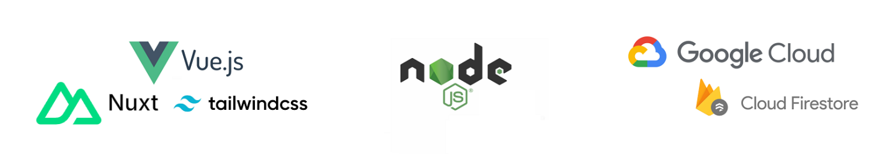

# PANOPTES Dash

This is a web app in development for the global citizen science program [Project PANOPTES](https://www.projectpanoptes.org/). It will list online PANOPTES robotic telescope units, with an interface for conveniently viewing their individual statuses and observing activity. 🔭🌐💻📱

Below is design/technical information and setup instructions for local development.

## Design and Technical Information

### Design Considerations

JavaScript and related web technologies were chosen to create this dashboard, as they are well-suited for the following requirements:

- Continuous, real-time (or periodic) unit telemetry updates
- Responsiveness and compatibility across different screen sizes and devices (phone, tablets, and computers)
- Strong 2D/3D data visualization tools, namely the [D3](https://d3js.org/) and [Three.js](https://threejs.org/) JavaScript libraries

*(Additionally, in the future, a tool like [Electron.js](https://www.electronjs.org/) can be used to modify this web app to run locally as a standalone computer program, perhaps bundled with control software to support offline units or those with bandwidth restrictions.)*

### Web Frameworks

A brief overview of the tech stack we're using.



- **Frontend**: The [Vue.js](https://vuejs.org/) framework (Composition API) with [Nuxt 3](https://nuxt.com/) (for server-side rendering capabilities) is used to create the dashboard UI, binding HTML to JavaScript automatically and coupling the real-time unit data to the UI components (i.e., with [Vuefire](https://vuefire.vuejs.org/)).
- The [Tailwind CSS](https://tailwindcss.com/) framework is largely used to style these components. Premade elements from the [Primevue](https://primevue.org/) component library are also incorporated.
- Fonts are from [Google Fonts](https://fonts.google.com/), including [Google's Material Symbols](https://fonts.google.com/icons); country flag icons are from the open-source [Flagpack](https://flagpack.xyz/) project.
- **Backend**: [Node.js](https://nodejs.org/en) along with Nuxt 3's [Nitro server engine](https://nuxt.com/docs/guide/concepts/server-engine) handle page routing, HTTP requests, and API/database connections. TypeScript is used whenever possible.
- **Deployment + API**: The app will use database and hosting services from the [Google Cloud Platform (GCP)](https://cloud.google.com/?hl=en), taking after the Project PANOPTES unit control software ([POCS](https://github.com/panoptes/POCS)), which uploads unit observations and telemetry there.

### Code Structure

Notable directories and files are listed below. You can visit the official [Nuxt Directory Structure documentation](https://nuxt.com/docs/guide/directory-structure/app) for more information.

```
📂 panoptes-dash (root directory)
│
├── 📂 dist
│   └── (The built public HTML and other assets generated by Nuxt are here. These get deployed to the cloud. Git ignored.)
│
├── 📂 assets
│   ├── 📄 tailwind.css (The gateway for Tailwind, specified in ./nuxt.config.ts)
│   └── (Other global stylesheets, images, and static assets go here.)
│
├── 📂 components
│   └── (Custom UI component .vue files are here.)
│
├── 📂 composables
│   ├── 📄 interfaces.ts (Defines the shape and structure of telemetry, metadata, and observation data objects.)
│   └── 📄 PanUnits.ts (Defines the PanUnit class attributes and methods for handling unit data from interfaces.ts.)
│
├── 📂 layouts
│   └── 📄 default.vue (Defines common HTML that all pages are wrapped in.)
│
├── 📂 pages
│   ├── 📄 index.vue (The main entry point to the app's home page.)
│   └── (All other page templates, from which Nuxt automatically generates routes.)
│
├── 📂 public
│   └── (Static assets like images, fonts, or external JS/CSS files.)
│
├── 📂 stores
│   └── 📄 units.js (Defines a Pinia store for managing unit data, querying the Firestore database, and binding the data to Vue components.)
│
├── 📄 App.vue (The root Nuxt component that sets up the basic layout and renders the current page.)
│
├── 📄 nuxt.config.ts (Configure Nuxt plugins, modules, server settings, etc. Note that this is where you define properties that usually go in an HTML file's header.)
│
├── 📄 package.json (Lists the app's dependencies and scripts.)
└── ...
```

A note regarding the `public` and `assets` directories: while both are for storing assets, files in the `public` directory don't get processed/optimized at all by Vite and are pushed to the website as-is. This is suitable for assets such as our favicons, logos, and 3D models (.glb files).

## Setup Instructions

Below are setup instructions to get this app running for local development, plus some notes on development and build routines.

### Prerequisites

Node.js will be required to run the following build commands. For this project, I am using version 20.11.1 (LTS) which can be downloaded for your system [here](https://nodejs.org/dist/v20.11.1/).

Additionally, for deploying the app to Google Cloud, a Google account and the [gcloud CLI](https://cloud.google.com/sdk/docs/install) are required.

### Installation

After cloning the repository, run `npm install` in both the root directory as well as the `vue-app` directory to get all the dependencies set up on your system. (You can view specific versions of libraries/frameworks being used under each directory's respective `package.json` file.)

### Running the App

To get the app running locally, ensure you are in the root directory. Then, there are different commands you can use (which have been set up in the app's `package.json` file):

- You can use `npm run dev` to start the app in development mode, which starts up a local [Vite](https://vitejs.dev/) server with live reloading and debugging tools.
- You can preview the app using `npm run start` —this is the same command that will be run automatically on Google Cloud during deployment.
- When you're ready for deployment, the `npm run build` command will compile everything, including all the updates you've made. It generates the current version of the app into the static HTML files in the `dist` directory. This built version is what will be served to actual users from the cloud. ☁

Tip: In its dev tools, Chrome has a handy tool for previewing different screen size breakpoints (and even specific mobile/tablet models). It can be enabled as you work by right-clicking within the browser > Inspect and then selecting the laptop/phone icon on the top left. Additionally, both Chrome and Firefox have great tools for visualizing CSS grid/flex box systems.

### Deployment

Deployments to Google Cloud are done locally from your terminal using the gcloud CLI. You will first need to be authenticated with your Google account using `gcloud auth login`. From the root directory of this project, you'll also need to set the working Cloud Project ID to be that of this project, with the command `gcloud config set project [Project ID]`. (You can view this info and manage the Google Cloud projects under your ownership from the [Google Cloud Console site](https://console.cloud.google.com/).)

Once the Cloud project has been initially set, you can continue to deploy and update the app from the root directory by running `gcloud run deploy [Name of Cloud Run service]` and following the prompts. Note that the deployment may take a couple of minutes. For this project, I have been using `us-central1` as the location from which this code will be run.
